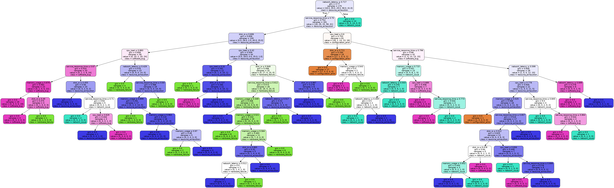

#  
#   
#   
#   
# AI-Driven Predictive Maintenance
## 📚 Documentation
Full project documentation is available here:  
[AI-Driven Predictive Maintenance Docs](https://rajamuhammadawais.github.io/ai_driven_predictive_maintenance/)

This repository contains modules and research for predictive maintenance using AI and machine learning techniques. The project is organized for clarity and scalability.

## Project Structure
- `src/`: Python scripts and models
- `data/`: Synthetic and real datasets
- `docs/`: Documentation and research
- `images/`: Diagrams and visualizations

## Overview
Predictive maintenance leverages AI to anticipate equipment failures, optimize resource allocation, and identify root causes of anomalies. This project includes:
- Data ingestion and preprocessing
- Anomaly detection
- Predictive failure detection
- Root cause analysis
- Time series forecasting

## Root Cause Decision Tree

## License
MIT
